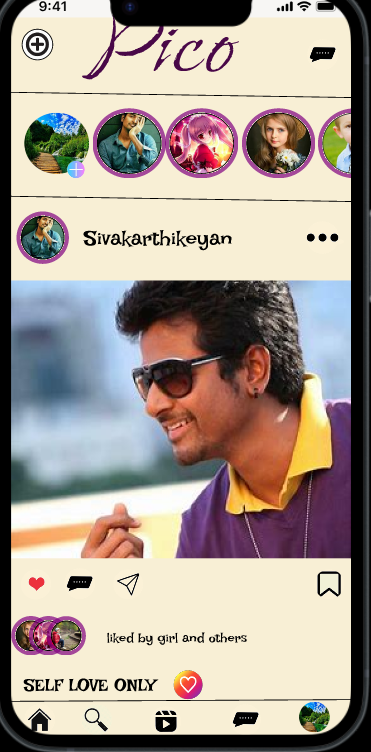
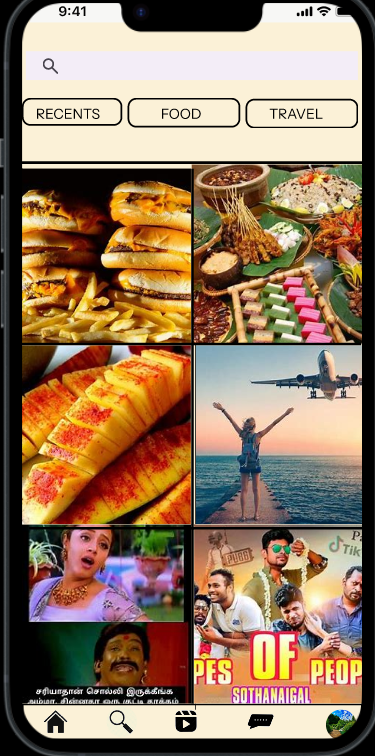
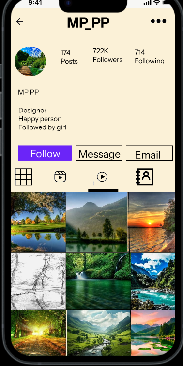
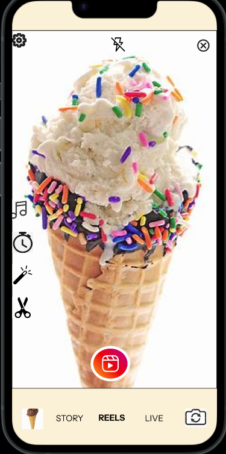

# My Figma Instagram Design Project

This project is a Figma-based UI design of Instagram, including core screens like Sign In, Sign Up, Feed, Home, Profile, and Reels creation.

## Sign In Page

## Sign Up Page

## Home Page

## Feed Page

## Profile Page

## Reels Making Page

